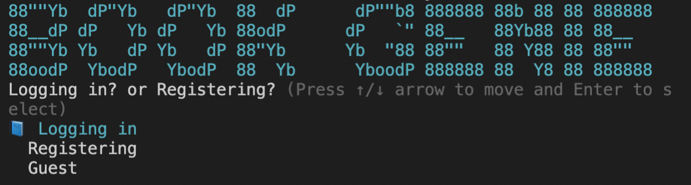

# Book Genie
A cli app that allows users to search for books to add to their reading lists. Built with Ruby and Active Record
## Prerequistes 
* Make sure you have [Ruby](https://www.ruby-lang.org/en/) installed
* Ensure you have [PostgreSQL](https://www.postgresql.org/) installed

* Head on over to [Google Books API](https://developers.google.com/books/docs/v1/getting_started) to get an API KEY

   * In the root directory create your `.env` file and assign and create the variable GOOGLE_BOOK_API_KEY = <"your key from google">
## Installation
1. fork the repository onto your local machine
2. `cd` into the cloned directory
3. run the command `bundle install` in terminal to install dependencies 
4. run the command  `rake db:create db:migrate db:seed` in order to create and set up the database
5. run `ruby bin/run.rb` to start to play

